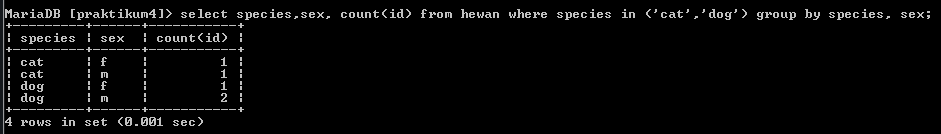

PRAKTIKUM 4
# Untuk tugas pertama yaitu pegawai

# DAFTAR TUGAS YANG DI MINTA PADA PEGAWAI 

- Tampilkan pegawai yang gajinya bukan 2.000.000 dan 1.250.000 !

-Tampilkan pegawai yang tunjangannya NULL!

Tampilkan pegawai yang tunjangannya tidak NULL!

-Tampilkan/hitung jumlah baris/record tabel pegawai!

-Tampilkan/hitung jumlah total gaji di tabel pegawai!

-Tampilkan/hitung rata-rata gaji pegawai!

-Tampilkan gaji terkecil!

-Tampilkan gaji terbesar!

# Tabel yang di minta 

# TUGAS 1 PEGAWAI

- Pertama kita menampilan gaji pegawai yang bukan 2.000.000 dan 1.250.000

- Langkah kedua kita tampilkan tunjangan pegawai yang NULL

- Langkah ketiga yaitu menampilkan tunjangan pegawai yang tidak NULL

- berikut nya kita menampilan atau menghitung jumlah baris atau record tabel pegawai

- Langkah selanjut nya hitung jumlah total gaji di tabel pegawai 

- Selanjutnya tampilkan/hitung rata-rata gaji pegawai

- Langkah berikut nya adalah tampilkan gaji terkecil 

- Langkah yang terakhir yaitu menampilkan gaji terbesar 

#  DAFTAR TUGAS YANG DI MINTA PADA HEWAN

- Tampilkan jumlah hewan yang dimiliki setiap owner.

- Tampilkan jumlah hewan berdasarkan spesies

- Tampilkan jumlah hewan berdasarkan jenis kelamin

- Tampilkan jumlah hewan berdasarkan spesies dan jenis kelamin

- Tampilkan jumlah hewan berdasarkan spesies (cat dan dog saja) dan jenis kelamin

- Tampilkan jumlah hewan berdasarkan jenis kelamin yang diketahui saja

# Tabel yang di minta

# TUGAS 2 HEWAN

- Langkah yang pertama yaitu menampilkan jumlah hewan yang di miliki setiap owner

- Langkah yang kedua menampilkan jumlah hewan berdasarkan pada spesies

- Langkah yang ketiga yaitu menamilkan jumlah hewan berdasar jenis kelamin

- Langkah keempat menampilkan jumlah hewan berdasarkan spesies dan jenis kelamin

- Langkah kelima jumlah hewan berdasarkan spesies (cat dan dog saja) dan jenis kelamin

- Langkah keenam sekaligus terakhir yaitu Tampilkan jumlah hewan berdasarkan jenis kelamin yang diketahui saja

# Kesimpulan dari kedua tugas yang di atas

# Tugas yang pertama yaitu pegawai

- Pada tugas di atas yaitu jumlah pegawai terdapat jumlah baris atau record yang ada pada tabel pegawai kita dapat menghitung dengan menggunakan perintah Select Count (*) kita harus menjalankan semua itu untuk mendapatkan jumlah atau keseluruhan secara akurat

- Pada tugas di atas yaitu total gaji pegawai yaitu total gaji dari pegawai yang ada pada tabel pegawai dapat kita hitung dengan cara melakukan perintah Select sum(gaji) From pegawai dengan menggunakan perintah tersebut kita tau bagaimana menghasilkan semua gaji karyawan 

- Pada tugas di atas yaitu total gaji pegawai yaitu rata rata gaji pegawai yang ada pada tabel pegawai dapat kita hitung dengan menggunakan perintah  Avg(gaji) From pegawai dengan menggunakan perintah di atas kita dapat mengetahui berapakah rata rata gaji seluruh pegawai 

- Pada tugas di atas ini memiliki fungsi yang saling berkebalikan yaitu gaji terkecil dan juga gaji terbesar nah dengan gaji kecil kita dapat tau gaji terkecil pada tabel pegawai yaitu dengan menggunakan perintah Select Min(gaji)from pegawai sedangkan gaji terbesar menggunakan perintah Select Max(gaji)from pegawai nah dengan menggunakan kedua perintah di atas kita tau bahka gaji yang terbesar dan terkecil pada semua pegawai 

# Kesimpulan dari tugas kedua yaitu hewan

- Seperti tugas di atas dengan jumlah hewan berdasarkan owner dengan menggunakan perintah klausa group by antara kolom owner dan juga id serta kita dapat menggunakan Count dengan perintah di atas kita tau jumlah hewan berdasarkan pada owner 

- Seperti tugas di atas dengan jumlah hewan berdasarkan spesies dengan menggunakan perintah klausa group by pada kolom spesies dan juga menggunakan fungsi Count dengan cara melakukan perintah di atas kita dapat mengetahui jumlah hewan berdasarkan spesies nya. 

- Seperti tugas di atas yaitu berdasarkan jenis kelamin dengan cara menggunakan perintah seperti ini klausa Group By yang ada pada kolom sex dan seperti di atas juga menggunakan fungsi Count dengan itu kita dapat mengetahui jenis kelamin dari hewan tersebut 

- Seperti tugas di atas yaitu berdasarkan spesies dan jenis kelamin (khusus cat dan dog) dengan menggunakan klausa Where yaitu untuk memfilter spesies yang kita mau atau inginkan dan juga klausa Group By yaitu pada kolom spesies dan juga sex serta fungsi Count dengan itu kita dapat mengetahui berapakah jumlah hewan berdasarkan spesies dan jenis kelamin (khusus cat dan dog)

- Seperti tugas di atas yaitu berdasarkan jenis kelamin yang diketahui dengan cara ini kita menggunakan perintah Klausa Where mempunyai fungsi untuk memfilter jenis kelamin yang yang tidak diketahui dan juga Klausa Gruop By pada kolom sex dan juga menggunakan perintah Count nah dengan perintah di atas kita dapat mengetahui hewan yang tidak di ketahui jenis kelamin nya 

- Inti Kesimpulan dari atas yaitu dengan berbagai cara kita dapat mengetahui banyak hal seeprti jumlah pegawai gaji rata rata pegawai jenis kelamin hewan jumlah owner hewan dengan menggunakan perintah perintah di atas sesuai yang di butuhkan
